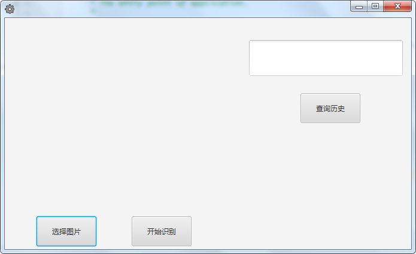
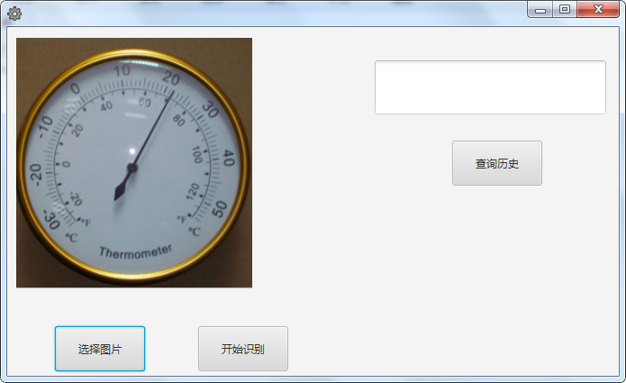
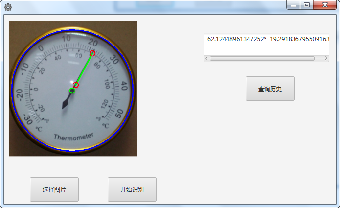
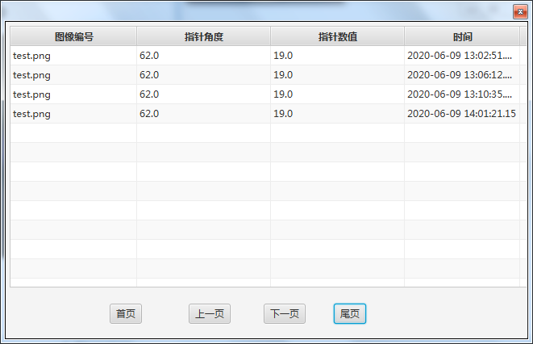

> # Springboot-Meter-Pointer-Detection-JavaFx
>

### Introduction

**This is a cross-platform application for instrument pointer detection based on Springboot and JavaFx. It implements instrument detection and pointer positioning through OpenCV function calls and stores the calculation results in the local Mysql database. At present, the application has been developed and tested under the Windows platform. Similarly, it can function normally under other operating system platforms.**


### Development Tools

- **Intellij**
- **Jdk 1.8**
- **Mysql 5.8.X**
- **JavaFx** 
- **Springboot 2.1.6.RELEASE**
- **Opencv 3.4.1-1.4.1**


### Screenshot

1. Start Interface

   

2. Main Interface

   

3. Do Detection

   

   

4. Show Log

   

### How To Build

```bash
git clone https://github.com/modianor/springboot-point-meter-detection-javafx.git
```


### Contact Me

> **QQ:	345563121**
>
> **E-MAIL:	modianserver@gmail.com**